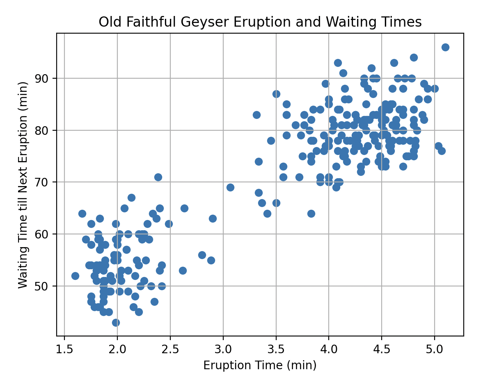
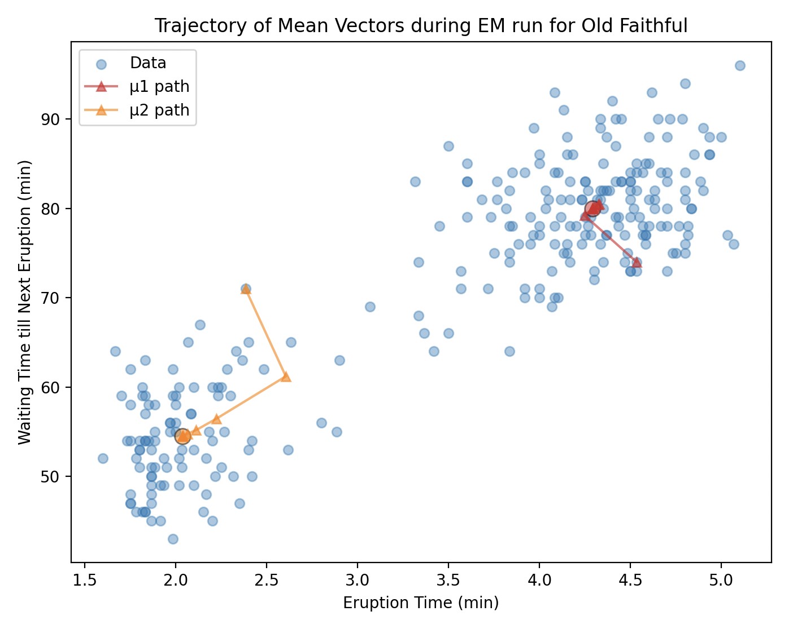
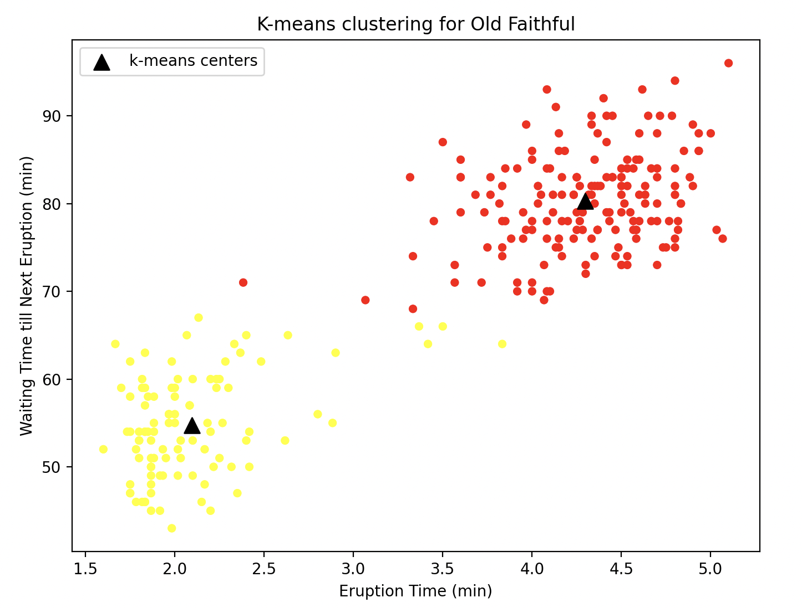

# Old-Faithful-Geyser-Data-Analysis
Utilizing Guassian Mixture Models and K-Means Clustering to analysis Geyser timings (eruption &amp; waiting times)

### To View Results
```bash
python -m venv venv

source venv/bin/activate

pip install -r requirement.txt

python analyze_data.py
```

### Results




